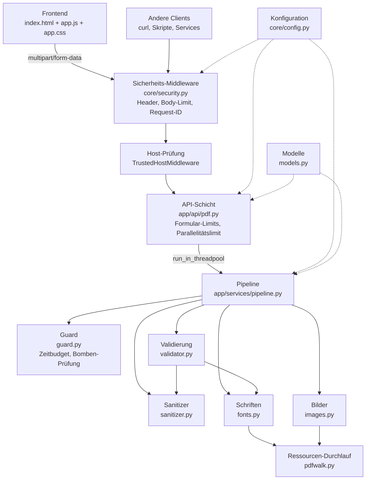
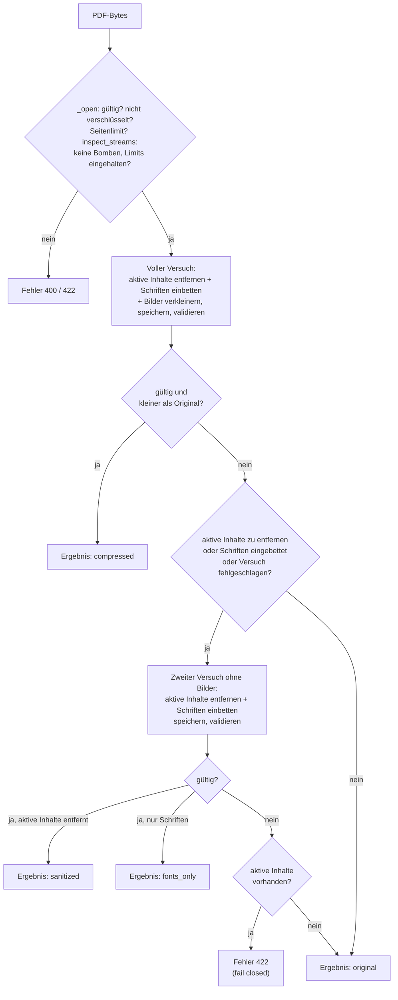

# PDF-Kompressor – Technische Dokumentation

Diese Dokumentation beschreibt den Aufbau des Projekts, jede Datei und jede Funktion.
Sie richtet sich an Entwicklerinnen und Entwickler, die das Tool betreiben, warten oder erweitern.
Für einen schnellen Einstieg (Installation, Start, API-Beispiele) siehe [README.md](../README.md),
für das Sicherheitskonzept und die Betriebs-Checkliste siehe [SECURITY.md](../SECURITY.md).

**Inhalt**
1. [Überblick](#1-überblick)
2. [Architektur und Ablauf](#2-architektur-und-ablauf)
3. [Verzeichnisstruktur](#3-verzeichnisstruktur)
4. [Konfiguration – `app/core/config.py`](#4-konfiguration--appcoreconfigpy)
5. [Datenmodelle – `app/models.py`](#5-datenmodelle--appmodelspy)
6. [App-Einstieg – `app/main.py`](#6-app-einstieg--appmainpy)
7. [API-Schicht – `app/api/pdf.py`](#7-api-schicht--appapipdfpy)
8. [Pipeline – `app/services/pipeline.py`](#8-pipeline--appservicespipelinepy)
9. [Ressourcen-Durchlauf – `app/services/pdfwalk.py`](#9-ressourcen-durchlauf--appservicespdfwalkpy)
10. [Schriften – `app/services/fonts.py`](#10-schriften--appservicesfontspy)
11. [Bilder – `app/services/images.py`](#11-bilder--appservicesimagespy)
12. [Validierung – `app/services/validator.py`](#12-validierung--appservicesvalidatorpy)
13. [Schutz vor präparierten Dateien – `app/services/guard.py`](#13-schutz-vor-präparierten-dateien--appservicesguardpy)
14. [Aktive Inhalte entfernen – `app/services/sanitizer.py`](#14-aktive-inhalte-entfernen--appservicessanitizerpy)
15. [Web-Sicherheit – `app/core/security.py` und `app/core/integrity.py`](#15-web-sicherheit--appcoresecuritypy-und-appcoreintegritypy)
16. [Frontend – `app/static/`](#16-frontend--appstatic)
17. [Tests – `tests/`](#17-tests--tests)
18. [Weitere Dateien](#18-weitere-dateien)
19. [Fehlerbehandlung und HTTP-Statuscodes](#19-fehlerbehandlung-und-http-statuscodes)
20. [Bekannte Grenzen und Hinweise für Erweiterungen](#20-bekannte-grenzen-und-hinweise-für-erweiterungen)

---

## 1. Überblick

Der PDF-Kompressor ist ein FastAPI-Backend mit einem schlanken Web-Frontend. Er macht vier Dinge:

| Funktion | Beschreibung |
|---|---|
| **Bilder verkleinern** | Rechnet Bilder auf eine von drei Ziel-Auflösungen herunter: `low` = 72 DPI, `medium` = 150 DPI, `high` = 300 DPI. Maßgeblich ist die *auf der Seite dargestellte* Auflösung, nicht die Pixelzahl. |
| **Schriften einbetten** | Findet nicht eingebettete Schriften, sucht die passende Schriftdatei auf dem Server und bettet sie ein. Gibt es sie nicht oder verbietet ihre Lizenz das Einbetten, wird eine mitgelieferte Ersatzschrift (Liberation) eingebettet. |
| **Aktive Inhalte entfernen** | Entfernt standardmäßig JavaScript, automatische Aktionen, Programmstarts, eingebettete Dateien, Multimedia und XFA. Normale Links bleiben erhalten. |
| **Nur wenn es funktioniert** | Jedes Ergebnis wird geprüft (lesbar, Seitenzahl, renderbar, Schriften, keine aktiven Inhalte). Ausgeliefert wird nur, was gültig ist. Sonst kommt das Original zurück, außer es enthält aktive Inhalte (dann wird die Datei abgelehnt). |

**Technische Rahmenbedingungen**
- Es wird nur Python mit pip-Paketen benötigt, keine externen Programme (kein Ghostscript, kein Docker).
- Alle Abhängigkeiten stehen unter freizügigen Lizenzen, AGPL/GPL ist nicht dabei (siehe [THIRD_PARTY_LICENSES.md](../THIRD_PARTY_LICENSES.md)).
- Die Verarbeitung läuft vollständig im Arbeitsspeicher. Es werden keine PDFs auf die Festplatte geschrieben (auch keine Temp-Dateien beim Upload) und keine Inhalte oder Dateinamen geloggt.
- Gehärtet für ein Hochrisiko-Umfeld: Limits gegen präparierte Dateien, strenge Security-Header, gepinnte Abhängigkeiten mit Hashes (Details in [SECURITY.md](../SECURITY.md) und den Abschnitten 13–15).

**Verwendete Bibliotheken und ihre Rolle**

| Bibliothek | Wofür im Projekt |
|---|---|
| `fastapi`, `uvicorn`, `python-multipart` | HTTP-Server, Routing, Datei-Upload |
| `pydantic`, `pydantic-settings` | Antwortmodelle, Konfiguration über Umgebungsvariablen |
| `pikepdf` (qpdf) | PDF öffnen, Objekte lesen und ändern, Content-Streams parsen, speichern |
| `Pillow` | Bilder skalieren und als JPEG kodieren |
| `fontTools` | Schriftdateien lesen (Namen, Metriken, Lizenz-Flags), Subsetting |
| `pypdfium2` | Ergebnis-PDF testweise rendern (Validierung, Tests) |

---

## 2. Architektur und Ablauf

### Schichten



- **Sicherheits-Middleware**: setzt Security-Header auf jede Antwort, begrenzt die Body-Größe schon beim Empfang und vergibt eine Request-ID. Danach prüft die `TrustedHostMiddleware` den Host-Header.
- **API-Schicht**: liest das Formular mit strengen Limits, begrenzt die Zahl gleichzeitiger Verarbeitungen, ruft die Pipeline auf und formt die Antwort (Datei oder JSON).
- **Pipeline**: steuert den Ablauf unter einem Zeitbudget und entscheidet, welches Ergebnis ausgeliefert wird.
- **Services** (`guard`, `sanitizer`, `fonts`, `images`, `validator`, `pdfwalk`): die eigentliche PDF-Logik. Sie wissen nichts von HTTP.

### Ablauf einer Komprimierung (`process_pdf`)



Die möglichen Ergebnisse (`X-Result` bzw. `report.result`):

| Wert | Bedeutung |
|---|---|
| `compressed` | Die Datei ist gültig und kleiner. Aktive Inhalte wurden (falls vorhanden) entfernt, Schriften (falls nötig) eingebettet, Bilder (falls nötig) verkleinert. |
| `sanitized` | Verkleinern hat nichts gebracht, aber aktive Inhalte mussten entfernt werden. Geliefert wird die bereinigte Version (ggf. mit eingebetteten Schriften) mit **unveränderten** Bildern. |
| `fonts_only` | Verkleinern hat nichts gebracht, aber Schriften mussten eingebettet werden. Geliefert wird die Version mit eingebetteten Schriften und **unveränderten** Bildern. Sie kann größer als das Original sein. |
| `original` | Keine Verbesserung möglich oder ein Fehler ist aufgetreten. Die Original-Bytes kommen unverändert zurück, der Grund steht in `warnings`. Das passiert **nie**, wenn die Datei aktive Inhalte enthält und deren Entfernung verlangt war. |

---

## 3. Verzeichnisstruktur

```
PDF_Kompressor/
├── .github/
│   ├── workflows/ci.yml        # CI: Tests, pip-audit, bandit (Windows + Linux, auch wöchentlich)
│   └── dependabot.yml          # automatische Update-Vorschläge
├── app/
│   ├── __init__.py
│   ├── main.py                 # FastAPI-App, Middlewares, Frontend-Auslieferung
│   ├── models.py               # Enums und Pydantic-Modelle
│   ├── api/
│   │   ├── __init__.py
│   │   └── pdf.py              # HTTP-Endpoints /api/v1/pdf/*
│   ├── core/
│   │   ├── __init__.py
│   │   ├── config.py           # Einstellungen (Umgebungsvariablen)
│   │   ├── security.py         # Security-Header, Body-Limit, Request-ID, Fehlerantworten
│   │   └── integrity.py        # Prüfsummen der mitgelieferten Schriften
│   ├── services/
│   │   ├── __init__.py
│   │   ├── pipeline.py         # Gesamtablauf und Entscheidungslogik
│   │   ├── guard.py            # Zeitbudget, Prüfung auf Dekompressions-/Pixel-Bomben
│   │   ├── sanitizer.py        # aktive Inhalte erkennen und entfernen
│   │   ├── pdfwalk.py          # Durchlaufen der PDF-Ressourcen
│   │   ├── fonts.py            # Schriften erkennen, finden, einbetten
│   │   ├── images.py           # Bild-DPI ermitteln, Bilder verkleinern
│   │   └── validator.py        # Ergebnis-PDF prüfen
│   ├── fonts/                  # Liberation-Ersatzschriften (12 TTF) + OFL.txt + SHA256SUMS
│   └── static/
│       ├── index.html          # Web-Frontend (nur HTML, CSP-konform)
│       ├── app.css             # Styles inkl. AOK-Farben
│       ├── app.js              # Frontend-Logik
│       └── favicon.svg
├── docs/
│   └── DOKUMENTATION.md        # diese Datei
├── tests/
│   ├── __init__.py
│   ├── conftest.py             # Test-Fixtures (erzeugen Test-PDFs, auch präparierte)
│   ├── test_api.py             # Funktionstests
│   └── test_security.py        # Sicherheitstests
├── requirements.in             # direkte Laufzeit-Abhängigkeiten
├── requirements.txt            # Lock-Datei: alle Pakete gepinnt, mit SHA-256-Hashes
├── requirements-dev.in         # direkte Test-/Prüf-Abhängigkeiten
├── requirements-dev.txt        # Lock-Datei für Tests und Prüfwerkzeuge
├── README.md
├── SECURITY.md                 # Sicherheitskonzept, KI-Risiken, Betriebs-Checkliste
├── THIRD_PARTY_LICENSES.md
└── .gitignore
```

---

## 4. Konfiguration – `app/core/config.py`

Zentrale Einstellungen auf Basis von `pydantic-settings`. Jeder Wert lässt sich über eine Umgebungsvariable
mit dem Präfix `PDF_` oder über eine `.env`-Datei im Projektordner überschreiben.

### Konstanten

| Name | Wert | Beschreibung |
|---|---|---|
| `APP_DIR` | Pfad zu `app/` | Basis für relative Pfade |
| `BUNDLED_FONT_DIR` | `app/fonts` | Ordner mit den Liberation-Ersatzschriften |

### `_default_font_dirs() -> list[str]`
Liefert die Standard-Ordner, in denen nach installierten Schriften gesucht wird:
- Windows: `%WINDIR%\Fonts` und `%LOCALAPPDATA%\Microsoft\Windows\Fonts` (Schriften, die nur für den Benutzer installiert sind)
- Linux: `/usr/share/fonts`, `/usr/local/share/fonts`, `~/.fonts`
- macOS: `/Library/Fonts`, `/System/Library/Fonts`

Ordner, die nicht existieren, werden später beim Indexieren einfach übersprungen.

### `class Settings(BaseSettings)`

| Feld | Typ | Default | Umgebungsvariable | Bedeutung |
|---|---|---|---|---|
| `max_upload_mb` | int | `50` | `PDF_MAX_UPLOAD_MB` | Maximale Upload-Größe in MB |
| `max_pages` | int | `5000` | `PDF_MAX_PAGES` | Maximale Seitenzahl einer PDF |
| `font_dirs` | list[str] | siehe oben | `PDF_FONT_DIRS` (JSON-Liste) | Ordner für die Schriftsuche |
| `downsample_threshold` | float | `1.5` | `PDF_DOWNSAMPLE_THRESHOLD` | Ein Bild wird erst verkleinert, wenn seine DPI über `Ziel-DPI × Faktor` liegt |
| `full_render_max_pages` | int | `20` | `PDF_FULL_RENDER_MAX_PAGES` | Bis zu dieser Seitenzahl wird bei der Validierung jede Seite gerendert, darüber nur Stichproben |
| **Web-Sicherheit** | | | | |
| `cors_origins` | list[str] | `[]` | `PDF_CORS_ORIGINS` (JSON-Liste) | Erlaubte fremde Origins; leer = CORS aus |
| `allowed_hosts` | list[str] | `["localhost", "127.0.0.1"]` | `PDF_ALLOWED_HOSTS` (JSON-Liste) | Erlaubte Host-Header; im Betrieb auf den Servernamen setzen |
| `enable_docs` | bool | `false` | `PDF_ENABLE_DOCS` | Swagger/ReDoc/OpenAPI einschalten (nur Entwicklung) |
| `hsts` | bool | `false` | `PDF_HSTS` | `Strict-Transport-Security` senden (nur hinter TLS) |
| **Schutz vor präparierten Dateien** | | | | |
| `max_concurrent` | int | CPU-Kerne | `PDF_MAX_CONCURRENT` | gleichzeitige Verarbeitungen |
| `queue_timeout_s` | float | `10` | `PDF_QUEUE_TIMEOUT_S` | Wartezeit auf einen freien Platz, danach `503` |
| `processing_timeout_s` | float | `300` | `PDF_PROCESSING_TIMEOUT_S` | Zeitbudget pro Datei (große Scans brauchen Minuten) |
| `max_stream_mb` | int | `100` | `PDF_MAX_STREAM_MB` | entpackte Größe pro Stream; Bilder dürfen so groß sein, wie ihre Maße verlangen |
| `max_total_decoded_mb` | int | `50000` | `PDF_MAX_TOTAL_DECODED_MB` | entpackte Größe aller Streams zusammen (begrenzt Rechenzeit, nicht Speicher) |
| `max_image_pixels` | int | `100000000` | `PDF_MAX_IMAGE_PIXELS` | Pixel pro Bild (auch als Pillow-Grenze gesetzt) |
| `max_objects` | int | `2000000` | `PDF_MAX_OBJECTS` | PDF-Objekte pro Datei |
| `max_fonts` | int | `5000` | `PDF_MAX_FONTS` | Schriften pro Datei (zusammengefügte PDFs bringen oft eigene mit) |
| `max_images` | int | `20000` | `PDF_MAX_IMAGES` | Bilder pro Datei |

**Property `max_upload_bytes`**: `max_upload_mb` in Bytes umgerechnet.

### `get_settings() -> Settings`
Liefert die Einstellungen als Singleton (`@lru_cache`). Die Umgebungsvariablen werden nur beim ersten Aufruf gelesen.
Änderungen an der Umgebung zur Laufzeit wirken erst nach einem Neustart.

---

## 5. Datenmodelle – `app/models.py`

### Enums

**`CompressionLevel(str, Enum)`**: die Komprimierungsstufe.

| Wert | Property `dpi` | Property `jpeg_quality` |
|---|---|---|
| `low` | 72 | 60 |
| `medium` | 150 | 75 |
| `high` | 300 | 85 |

`jpeg_quality` ist die Qualität (0–100), mit der verkleinerte Bilder als JPEG gespeichert werden.

**`FallbackFont(str, Enum)`**: die gewünschte Ersatzschrift.

| Wert | Ersatzschrift | Wann |
|---|---|---|
| `auto` | wird pro Schrift gewählt | Mono, wenn die Schrift dicktengleich ist oder so heißt (Courier, Consolas …); Serif, wenn sie Serifen hat (Times, Georgia …); sonst Sans |
| `sans` | Liberation Sans | metrisch kompatibel zu Arial/Helvetica |
| `serif` | Liberation Serif | metrisch kompatibel zu Times New Roman |
| `mono` | Liberation Mono | metrisch kompatibel zu Courier New |

**`ResultKind(str, Enum)`**: `compressed`, `fonts_only`, `sanitized`, `original` (siehe [Abschnitt 2](#2-architektur-und-ablauf)).

**`FontStatus(str, Enum)`**: Zustand einer Schrift im Report.

| Wert | Bedeutung |
|---|---|
| `already_embedded` | war schon eingebettet (auch Type3-Schriften, die ihre Glyphen immer selbst enthalten) |
| `embedded` | wurde mit der **Originalschrift** vom Server eingebettet |
| `fallback` | wurde mit einer **Ersatzschrift** eingebettet |
| `skipped` | nicht eingebettet; der Grund steht in `reason` |

### Pydantic-Modelle

**`FontInfo`**: eine Schrift im Report.

| Feld | Typ | Beschreibung |
|---|---|---|
| `name` | str | Name aus der PDF ohne Subset-Präfix, z. B. `Helvetica` |
| `subtype` | str | PDF-Schrifttyp: `Type1`, `TrueType`, `Type0`, `Type3`, `MMType1` |
| `status` | FontStatus | siehe oben |
| `used_font` | str \| None | PostScript-Name der eingebetteten Schrift, z. B. `ArialMT` oder `LiberationSans` |
| `reason` | str \| None | Begründung bei `fallback` oder `skipped` |

**`ImageInfo`**: ein Bild in der Analyse.

| Feld | Typ | Beschreibung |
|---|---|---|
| `width`, `height` | int | Pixelgröße |
| `effective_dpi` | float \| None | kleinste dargestellte Auflösung (also die größte Darstellung auf einer Seite); `None`, wenn nicht ermittelbar |
| `filter` | str \| None | Kompressionsfilter, z. B. `DCTDecode` (JPEG), `FlateDecode` |
| `downsampled` | bool | Reserviert, wird bei der Analyse derzeit immer mit `false` geliefert |
| `skip_reason` | str \| None | warum das Bild nicht verkleinert werden kann (z. B. `Farbraum /DeviceCMYK`) |

**`CompressionReport`**: Bericht einer Komprimierung.

| Feld | Typ | Beschreibung |
|---|---|---|
| `original_size` | int | Bytes der hochgeladenen Datei |
| `result_size` | int | Bytes der gelieferten Datei |
| `result` | ResultKind | `compressed` / `fonts_only` / `original` |
| `level` | CompressionLevel | gewählte Stufe |
| `dpi` | int | Ziel-DPI der Stufe |
| `images_downsampled` | int | Anzahl verkleinerter Bilder |
| `fonts` | list[FontInfo] | alle Schriften der PDF |
| `active_content_removed` | list[str] | entfernte aktive Inhalte, z. B. `Dokument beim Öffnen: Aktion JavaScript` |
| `warnings` | list[str] | Hinweise (verworfene Versuche, nicht einbettbare Schriften …); feste Texte ohne technische Details |

Properties (nicht Teil des JSON): `fonts_embedded` zählt die Schriften mit Status `embedded`, `fonts_fallback` die mit Status `fallback`.
Beide werden für die Response-Header und das Logging verwendet.

**`CompressBase64Response`**: Antwort von `/compress/base64`: `filename`, `content_base64` (PDF als Base64) und `report`.

**`AnalyzeResponse`**: Antwort von `/analyze`: `filename`, `size`, `pages`, `fonts: list[FontInfo]`, `images: list[ImageInfo]`, `active_content: list[str]` (gefundene aktive Inhalte).

---

## 6. App-Einstieg – `app/main.py`

Erzeugt die FastAPI-Instanz `app`, die mit `uvicorn app.main:app` gestartet wird.

| Element | Beschreibung |
|---|---|
| `STATIC_DIR` | `app/static`, dort liegen `index.html`, `app.js`, `app.css`, `favicon.svg` und optional `logo.svg` |
| Logging | Format `Zeit Level [Request-ID] Logger: Nachricht`, Level INFO. Der `RequestIdFilter` hängt an jede Zeile die Request-ID an. |
| `MultiPartParser.spool_max_size` | wird auf Upload-Limit + 1 MB gesetzt. Starlette würde Uploads sonst ab 1 MB als Temp-Datei auf die Platte schreiben; so bleiben sie im Arbeitsspeicher. |
| `lifespan(_)` | Beim Start: 1. `verify_bundled_fonts()` prüft die Ersatzschriften gegen `SHA256SUMS`; bei Abweichung startet die App **nicht**. 2. Ein Hintergrund-Thread baut `system_font_index()` auf, damit der erste Request nicht warten muss. |
| `FastAPI(docs_url=…, redoc_url=…, openapi_url=…)` | Swagger, ReDoc und das OpenAPI-Schema gibt es nur mit `PDF_ENABLE_DOCS=true`; sonst liefern die Pfade `404`. |
| `add_exception_handler(Exception, …)` | unerwartete Fehler → `500` mit Referenz-ID, ohne Stacktrace (siehe [Abschnitt 15](#15-web-sicherheit--appcoresecuritypy-und-appcoreintegritypy)) |
| `CORSMiddleware` | wird **nur** hinzugefügt, wenn `PDF_CORS_ORIGINS` gesetzt ist; ohne Credentials, nur `GET`/`POST`, nur Header `Content-Type`. `expose_headers` gibt die Report-Header frei. |
| `TrustedHostMiddleware` | lehnt Anfragen mit einem Host-Header außerhalb von `PDF_ALLOWED_HOSTS` mit `400` ab (Schutz gegen Host-Header-Angriffe) |
| `SecurityMiddleware` | als letzte hinzugefügt und damit **äußerste** Middleware: Security-Header, Body-Limit, Request-ID gelten für alle Antworten, auch für abgelehnte Hosts und Fehler |
| `include_router(pdf_router)` | Endpoints unter `/api/v1/pdf` |
| `mount("/static", StaticFiles(...))` | liefert die Frontend-Dateien aus |

### Endpoints in `main.py`

| Methode + Pfad | Funktion | Antwort |
|---|---|---|
| `GET /health` | `health()` | `{"status": "ok"}` für Monitoring und Load Balancer |
| `GET /api/v1/config` | `client_config()` | `{"max_upload_mb": 50, "docs_enabled": false}`; das Frontend liest daraus das Upload-Limit und ob der Docs-Link angezeigt wird |
| `GET /` | `frontend()` | liefert `app/static/index.html` aus (nicht im OpenAPI-Schema) |

---

## 7. API-Schicht – `app/api/pdf.py`

Alle Endpoints unter dem Präfix `/api/v1/pdf` (`router`), Tag `pdf`.
Das Formular wird **nicht** über FastAPI-Parameter gelesen, sondern in `parse_form` selbst, weil nur so strenge Limits
für Dateien und Felder möglich sind (Starlette erlaubt sonst 1000 Dateien und 1000 Felder pro Formular).

### Konstanten und Zustand

| Name | Wert | Beschreibung |
|---|---|---|
| `CHUNK` | 1 MB | Blockgröße beim Einlesen des Uploads |
| `FORM_LIMITS` | `max_files=1`, `max_fields=10`, `max_part_size=16 KB` | Grenzen für das Multipart-Formular (Textfelder höchstens 16 KB) |
| `_slots` | `threading.BoundedSemaphore(max_concurrent)` | freie Verarbeitungsplätze (Parallelitätslimit) |

### `class CompressParams(BaseModel)`
Textfelder des Compress-Formulars mit Defaults: `level=medium`, `fallback_font=auto`, `embed_fonts=true`, `remove_active_content=true`.
`extra="forbid"`: unbekannte Felder werden mit `422` abgelehnt.

### `class AnalyzeParams(BaseModel)`
Leeres Modell mit `extra="forbid"`: `/analyze` akzeptiert nur das Feld `file`.

### `_form_schema(params) -> dict`
Erzeugt die OpenAPI-Beschreibung des Multipart-Formulars (Datei + Felder aus dem Pydantic-Modell) für `openapi_extra`.
So zeigt Swagger (falls aktiviert) die Felder trotz manuellem Parsen korrekt an.

### `async parse_form(request, params_model) -> (bytes, Dateiname, Parameter)`
1. `Content-Type` muss `multipart/form-data` sein, sonst `415`.
2. `request.form(**FORM_LIMITS)`; ein Verstoß gegen die Limits oder ein kaputtes Formular führt zu `400` „Ungültiges Formular“.
3. Es muss **genau eine** Datei im Feld `file` geben, sonst `400`. Doppelte Textfelder ergeben ebenfalls `400`.
4. Textfelder mit dem Pydantic-Modell prüfen. Fehler → `422` mit Feldname, Fehlertyp und Meldung, aber **ohne die Eingabewerte** (`include_input=False`), damit nichts vom Angreifer Eingeschleustes zurückgespiegelt wird.
5. Datei mit `_read_limited` lesen. Das Formular wird im `finally` geschlossen, damit der Speicher sofort freigegeben wird.

### `async _read_limited(file) -> bytes`
Liest die Datei in 1-MB-Blöcken. Mehr als `max_upload_mb` ergibt `413`, eine leere Datei `400`.
(Zusätzlich begrenzt die `SecurityMiddleware` den gesamten Request-Body schon beim Empfang.)

### `_run_limited(fn, *args)`
Läuft im Threadpool. Wartet bis zu `queue_timeout_s` auf einen freien Platz in `_slots`; ist keiner frei,
antwortet der Server mit `503` und `Retry-After: 10`. Danach wird `fn` ausgeführt und der Platz im `finally` wieder freigegeben.

### `async _execute(request, endpoint, fn, *args)`
Führt `fn` über `_run_limited` im Threadpool aus, damit die CPU-lastige PDF-Verarbeitung den Event-Loop nicht blockiert.
Eine `PdfProcessingError` wird in eine `HTTPException` mit ihrem Statuscode und ihrer **festen** Meldung umgewandelt.
Schreibt je Anfrage eine **Audit-Zeile** ins Log: `audit endpoint=… client=… status=… dauer=…` (ohne Dateinamen und Inhalte).

### `output_filename(upload_name) -> str`
`<bereinigter Name>_compressed.pdf`; der Name wird mit `safe_filename_stem` bereinigt (siehe [Abschnitt 15](#15-web-sicherheit--appcoresecuritypy-und-appcoreintegritypy)).

### `async run_compression(request, endpoint) -> (ProcessResult, Dateiname)`
Gemeinsamer Kern beider Compress-Endpoints: Formular lesen (`parse_form`) und `process_pdf(...)` über `_execute` ausführen.

### `POST /api/v1/pdf/compress` → `compress_file(request)`
Liefert die PDF-Datei direkt (`application/pdf`).
- **`Content-Disposition`**: `attachment; filename="<ASCII-Name>"; filename*=UTF-8''<URL-kodierter Name>`.
  Der ASCII-Name ist ein Ersatz für alte Clients (Umlaute werden zu `_`). Moderne Browser verwenden `filename*` mit korrekten Umlauten.
- **Report-Header**:

| Header | Inhalt |
|---|---|
| `X-Original-Size` | Größe der Originaldatei in Bytes |
| `X-Result-Size` | Größe der gelieferten Datei in Bytes |
| `X-Result` | `compressed` / `fonts_only` / `sanitized` / `original` |
| `X-Compression-Level` | `low` / `medium` / `high` |
| `X-Images-Downsampled` | Anzahl verkleinerter Bilder |
| `X-Fonts-Embedded` | Anzahl mit Originalschrift eingebetteter Schriften |
| `X-Fonts-Fallback` | Anzahl mit Ersatzschrift eingebetteter Schriften |
| `X-Active-Content-Removed` | Anzahl entfernter aktiver Inhalte |
| `X-Warnings` | Anzahl Warnungen (die Texte liefert nur der Base64-Endpoint) |
| `X-Request-ID` | Referenz (von der `SecurityMiddleware` gesetzt) |

### `POST /api/v1/pdf/compress/base64` → `compress_base64(request)`
Gleiche Verarbeitung, aber JSON-Antwort `CompressBase64Response` mit `content_base64` und dem vollständigen `report`.
Für dieselbe Eingabe sind die dekodierten Bytes identisch mit der Antwort von `/compress` (die Ausgabe ist deterministisch, siehe `_save` in [Abschnitt 8](#8-pipeline--appservicespipelinepy)).

### `POST /api/v1/pdf/analyze` → `analyze(request)`
Nur das Formularfeld `file`. Liefert `AnalyzeResponse` mit allen Schriften, Bildern und **gefundenen aktiven Inhalten**.
Die Datei wird dabei **nicht** verändert. Auch die Analyse läuft unter Parallelitätslimit, Zeitbudget und Bomben-Prüfung.

---

## 8. Pipeline – `app/services/pipeline.py`

Steuert den Gesamtablauf und trifft die Entscheidung „nur wenn es funktioniert“. Sicherheitsprinzipien:
Jede Datei wird vorab gegen die Limits geprüft, alles läuft unter einem Zeitbudget, Clients erhalten nur feste Meldungen,
und bei aktiven Inhalten gilt **fail closed**.

### Exceptions
Alle erben von `PdfProcessingError`. Jede Klasse hat einen `status_code` und eine feste, für Clients unbedenkliche `message`
(ohne Exception-Texte, Pfade oder Bibliotheksdetails). Die technischen Details stehen nur im Log.

| Klasse | `status_code` | Meldung / Wann |
|---|---|---|
| `PdfProcessingError` | 400 | Basisklasse |
| `InvalidPdfError` | 400 | „Die Datei ist keine gültige PDF“: Header `%PDF-` fehlt oder Datei beschädigt |
| `EncryptedPdfError` | 422 | passwortgeschützt oder mit Rechte-Beschränkung verschlüsselt |
| `TooManyPagesError` | 422 | mehr Seiten als `max_pages` |
| `LimitExceededError` | 422 | eine Sicherheitsgrenze aus `guard.inspect_streams` ist überschritten (Größe, Pixel, Anzahl) |
| `ProcessingTimeoutError` | 422 | Zeitbudget `processing_timeout_s` abgelaufen |
| `ActiveContentError` | 422 | aktive Inhalte vorhanden, konnten aber nicht sicher entfernt werden (fail closed) |

### `class ProcessResult` (dataclass)
`data: bytes` (die auszuliefernde PDF) und `report: CompressionReport`.

### `_open(data, inspect=True) -> pikepdf.Pdf`
Öffnet die PDF aus dem Speicher und prüft sie. Muss innerhalb von `guarded(...)` laufen.
Mit `inspect=False` wird Schritt 5 übersprungen. Das nutzen die Verarbeitungsversuche, weil genau dieselben Bytes zuvor in `_process` schon geprüft wurden. So läuft die aufwendige Stream-Prüfung nur **einmal pro Datei**.
1. Die Bytes müssen (nach führendem Leerraum) mit `%PDF-` beginnen, sonst `InvalidPdfError`.
2. `pikepdf.open`: Ein fehlendes Passwort ergibt `EncryptedPdfError`, eine beschädigte Datei `InvalidPdfError` (Details nur im Log).
3. `pdf.is_encrypted`: Auch PDFs mit reiner Rechte-Beschränkung werden abgelehnt, da das Verändern gegen die Beschränkung verstoßen würde.
4. Seitenzahl gegen `max_pages` prüfen.
5. **`inspect_streams(pdf, settings)`**: Jeder Stream wird auf Dekompressions- und Pixel-Bomben geprüft, bevor irgendeine Bibliothek ihn entpackt.
   Ein Verstoß ergibt `LimitExceededError`. Bei jedem Fehler wird die PDF wieder geschlossen.

### `_save(pdf) -> bytes`
Speichert die PDF in den Speicher:
- `remove_unreferenced_resources()` entfernt Ressourcen, auf die keine Seite mehr verweist.
- `compress_streams=True` komprimiert alle unkomprimierten Streams (z. B. neu eingebettete Schriften).
- `recompress_flate=True` komprimiert vorhandene Flate-Streams neu (oft kleiner).
- `object_stream_mode=generate` fasst kleine Objekte in komprimierten Object Streams zusammen.
- `deterministic_id=True`: Die Datei-ID wird aus dem Inhalt berechnet statt zufällig, sodass gleiche Eingabe gleiche Ausgabe ergibt.
- Da qpdf nur Objekte schreibt, die vom Dokument aus erreichbar sind, verschwinden entfernte aktive Inhalte (z. B. eingebettete Dateien) vollständig aus der Datei.

### `class _Attempt` (dataclass)
Ergebnis eines Verarbeitungsversuchs: `data`, `fonts`, `images_downsampled`, `warnings`, `active_removed` (Liste der entfernten aktiven Inhalte).

### `_attempt(data, level, fallback, embed, with_images, sanitize) -> _Attempt`
Führt einen vollständigen Versuch auf einer **frischen** Kopie der Original-PDF aus:
1. PDF öffnen (`_open(data, inspect=False)`; die Limits wurden bereits in `_process` geprüft).
2. Bei `sanitize=True`: `sanitizer.remove_active_content(pdf)` (vor allen anderen Schritten).
3. Bei `embed=True`: `fonts.embed_missing_fonts(...)`; sonst nur `fonts.analyze_fonts(...)` für den Report.
4. Bei `with_images=True`: `images.downsample_images(...)` mit DPI und JPEG-Qualität der Stufe.
5. Speichern (`_save`).
6. `validate(...)`: Seitenzahl gleich, renderbar, nicht mehr Schriften uneingebettet als erwartet und bei `sanitize=True` **keine aktiven Inhalte mehr**.

### `_fonts_changed(attempt) -> bool`
`True`, wenn im Versuch mindestens eine Schrift den Status `embedded` oder `fallback` hat.

### `_try(label, fn, warnings)`
Führt einen Versuch aus und entscheidet über Fehler:
- `ProcessingTimeout` (Zeitbudget) → `ProcessingTimeoutError`: Abbruch der ganzen Anfrage.
- `PdfProcessingError` → wird weitergereicht.
- jeder andere Fehler (inkl. `ValidationError`) → wird **verworfen**: Stacktrace ins Log, eine feste Warnung in `warnings`, Rückgabe `None`.

### `process_pdf(data, level, fallback, embed_fonts, remove_active=True) -> ProcessResult`
Einstieg für beide Compress-Endpoints. Aktiviert mit `guarded(settings)` das Zeitbudget und ruft `_process` auf.

### `_process(...)`
1. **Frühe Prüfung** mit `_open`: Schriftanalyse des Originals merken und **aktive Inhalte suchen** (`find_active_content`).
   `sanitize = remove_active and aktive Inhalte gefunden`.
2. **Voller Versuch** (`_attempt` mit Bereinigung, Schriften und Bildern) über `_try`.
3. **Entscheidung** (siehe Diagramm in [Abschnitt 2](#2-architektur-und-ablauf)):
   - voller Versuch gültig **und** kleiner → `compressed`
   - sonst, wenn bereinigt werden muss oder Schriften geändert wurden bzw. der Versuch fehlschlug: zweiter Versuch **ohne Bilder** → `sanitized` (wenn bereinigt wurde) bzw. `fonts_only`
   - sonst → `original` (mit dem Hinweis „bereits optimal“, falls der volle Versuch gültig, aber nicht kleiner war)
4. **Fail closed**: Musste bereinigt werden und ist das Ergebnis trotzdem `original`, wird `ActiveContentError` (`422`) geworfen.
   Die Originaldatei mit aktiven Inhalten wird also nie ausgeliefert.
5. Mit `remove_active=False` und gefundenen aktiven Inhalten wird eine Warnung ergänzt.
6. Report bauen. Beim Ergebnis `original` enthält er die Schriften des Originals und `images_downsampled = 0`.
7. Log-Zeile mit Größen, Ergebnis, Stufe, Schriftzahlen, Anzahl entfernter aktiver Inhalte und Dauer (ohne PDF-Inhalte oder Dateinamen).

### `analyze_pdf(data, filename) -> AnalyzeResponse`
Öffnet die PDF unter `guarded(...)` (mit denselben Prüfungen wie `_open`) und liefert Schrift-, Bild- und Aktiv-Inhalts-Analyse, ohne etwas zu verändern.

---

## 9. Ressourcen-Durchlauf – `app/services/pdfwalk.py`

In einer PDF hängen Schriften und Bilder an „Resource-Dictionaries“: an Seiten, aber auch an verschachtelten
Form-XObjects, Mustern, Type3-Schriften und Annotationen (z. B. Formularfelder). Dieses Modul findet alle davon.

### `object_key(obj) -> tuple[int, int] | int`
Eindeutiger Schlüssel für ein PDF-Objekt, um Doppelte zu erkennen: bei indirekten Objekten die Objektnummer
(`objgen`), bei direkten Objekten die Python-`id()`.

### `page_resources(page) -> Dictionary | None`
Liefert `/Resources` einer Seite. Fehlt der Eintrag, wird im Seitenbaum über `/Parent` nach oben gesucht
(Ressourcen dürfen laut PDF-Standard vererbt werden). Die Suche geht höchstens 64 Ebenen hoch, als Schutz vor kaputten Zyklen.

### `iter_resources(pdf) -> Iterator[Dictionary]`
Liefert jedes Resource-Dictionary der Datei **genau einmal**:
- Startpunkte: die Ressourcen jeder Seite und die Ressourcen der Appearance-Streams (`/AP` → `/N`, `/R`, `/D`) aller Annotationen.
- Von dort geht es rekursiv (über einen Stack, ohne Rekursionstiefe) weiter in:
  Form-XObjects (`/XObject` mit `/Subtype /Form`), Muster (`/Pattern`) und Type3-Schriften (`/Font` mit eigenen `/Resources`).
- Bereits besuchte Dictionaries werden über `object_key` übersprungen. Das schützt auch vor Zyklen.

---

## 10. Schriften – `app/services/fonts.py`

Der umfangreichste Teil. Er erkennt nicht eingebettete Schriften, sucht passende Schriftdateien und bettet sie
so ein, dass Text und Layout unverändert bleiben.

### Hintergrund in Kürze
- **Simple Fonts** (`Type1`, `TrueType`, `MMType1`) kodieren jedes Zeichen mit 1 Byte (Codes 0–255). Welches Zeichen ein Code bedeutet,
  bestimmt das `/Encoding` (z. B. `WinAnsiEncoding` plus `/Differences`). Die Breite jedes Zeichens steht in `/Widths`.
- **Eingebettet** ist eine Schrift, wenn ihr `FontDescriptor` einen `/FontFile`, `/FontFile2` (TrueType) oder `/FontFile3` (CFF/OpenType) enthält.
- Die **Standard-14-Schriften** (Helvetica, Times, Courier, Symbol, ZapfDingbats in Varianten) haben oft gar keinen FontDescriptor und keine `/Widths`.

### Konstanten

| Name | Beschreibung |
|---|---|
| `SIMPLE_SUBTYPES` | Schrifttypen, die eingebettet werden können: `/Type1`, `/TrueType`, `/MMType1` |
| `SYMBOLIC_NAMES` | Namensteile symbolischer Schriften (Symbol, ZapfDingbats, Wingdings …); diese werden nicht ersetzt |
| `FAMILY_ALIASES` | Zuordnung von PDF-Namen zu gängigen Schriftfamilien: `helvetica` → `arial`, `times`/`timesroman` → `timesnewroman`, `courier` → `couriernew` usw. |
| `SERIF_HINTS`, `MONO_HINTS` | Namensteile, an denen Serifen- bzw. Monospace-Schriften erkannt werden (für `fallback_font=auto`) |
| `LIBERATION` | `FallbackFont` → Dateiname der Ersatzschrift (`LiberationSans`, `LiberationSerif`, `LiberationMono`) |
| `FS_TYPE_RESTRICTED` (0x0002), `FS_TYPE_NO_SUBSET` (0x0100), `FS_TYPE_BITMAP_ONLY` (0x0200) | Bits des Lizenz-Felds `OS/2.fsType` einer Schriftdatei |
| `FLAG_FIXED` (1), `FLAG_SERIF` (2), `FLAG_SYMBOLIC` (4), `FLAG_NONSYMBOLIC` (32), `FLAG_ITALIC` (64) | Bits im PDF-Feld `FontDescriptor /Flags` |
| `BASE_ENCODINGS` | Tabellen Code → Glyphname für `WinAnsiEncoding`, `MacRomanEncoding` und `StandardEncoding` |

Beim Import wird zusätzlich das Log-Level von `fontTools` auf ERROR gesetzt, da die Bibliothek sonst viele harmlose Details meldet.

### Hilfsfunktionen für Namen

**`_norm(s) -> str`**: Kleinschreibung, nur Buchstaben und Ziffern. `"Times New Roman"` → `"timesnewroman"`. Damit werden Namen robust verglichen.

**`strip_subset_prefix(name) -> str`**: Entfernt den führenden `/` und ein Subset-Präfix aus 6 Großbuchstaben. `"/ABCDEF+Arial-BoldMT"` → `"Arial-BoldMT"`.

### `class FontRequest` (frozen dataclass)
Was die PDF über eine Schrift aussagt: `base_name` (ohne Präfix), `family` (normalisiert und über Aliase aufgelöst), `bold`, `italic`, `serif`, `fixed`, `symbolic`.

### `parse_font_request(font, descriptor) -> FontRequest`
Leitet aus dem Font-Dictionary und dem FontDescriptor ab, welche Schrift gemeint ist:
- **Familie**: Der Teil vor dem ersten `,` oder `-` wird normalisiert. Endungen `mt`/`psmt` (Microsoft-Namen wie `ArialMT`, `TimesNewRomanPSMT`)
  und angehängte Stilwörter (`bold`, `italic` …) werden entfernt, dann wird `FAMILY_ALIASES` angewendet.
  Beispiele: `Arial-BoldMT` → `arial`, `Helvetica-Bold` → `arial`, `TimesNewRomanPS-BoldMT` → `timesnewroman`.
- **Fett**: `/FontWeight ≥ 600` oder der Name enthält `bold`, `black`, `heavy`, `semibold`, `demi`.
- **Kursiv**: Flag `Italic` oder der Name enthält `italic`/`oblique`.
- **Symbolisch**: Der Name passt zu `SYMBOLIC_NAMES`, oder das Flag `Symbolic` ist ohne `Nonsymbolic` gesetzt.
- **Serif/Fixed**: aus den Flags oder den Namens-Hinweisen.

### Analyse

**`class PdfFontRef`** (dataclass): Verweis auf eine Schrift in der PDF: `font` (Font-Dictionary), `descriptor` (FontDescriptor oder `None`), `subtype`, `embedded`.

**`_font_descriptor(font) -> (descriptor, subtype)`**: Liefert den FontDescriptor. Bei `Type0` (zusammengesetzte Schriften, meist CJK) liegt er am ersten `DescendantFont`.

**`_is_embedded(descriptor) -> bool`**: `True`, wenn `FontFile`, `FontFile2` oder `FontFile3` vorhanden ist.

**`collect_fonts(pdf) -> list[PdfFontRef]`**: Sammelt über `iter_resources` alle Schriften der Datei, jede nur einmal.
`Type3`-Schriften gelten immer als eingebettet, weil ihre Glyphen in der PDF selbst gezeichnet sind.

**`analyze_fonts(pdf) -> list[FontInfo]`**: Report-Einträge ohne Änderung: `already_embedded` bzw. `skipped` für nicht eingebettete Schriften.

**`count_unembedded(pdf) -> int`**: Anzahl nicht eingebetteter Schriften. Wird von der Validierung verwendet.

### System-Schriftindex

**`class FontFileEntry`** (frozen dataclass): eine Schriftdatei: `path`, `index` (Position in einer `.ttc`-Sammlung, sonst 0),
`ps_name`, `full_name`, `family` (alle normalisiert), `bold`, `italic`.

**`_name(tt, *ids) -> str`**: Liest den ersten vorhandenen Eintrag aus der `name`-Tabelle der Schrift.
Verwendete IDs: 1 = Familie, 4 = voller Name, 6 = PostScript-Name, 16 = typografische Familie.

**`_entry_from_ttfont(tt, path, index) -> FontFileEntry`**: Baut einen Index-Eintrag. Fett/kursiv kommt aus `OS/2.fsSelection` (Bit 5 / Bit 0) oder `head.macStyle`.

**`system_font_index() -> tuple[FontFileEntry, ...]`**: Durchsucht alle `font_dirs` rekursiv nach `.ttf`, `.otf` und `.ttc`
und liest nur die Namens- und Stilinformationen (`lazy=True`, schnell). Nicht lesbare Dateien werden übersprungen.
Das Ergebnis wird mit `@lru_cache` **einmal pro Prozess** gecacht. Neu installierte Schriften werden erst nach einem Neustart gefunden.
`main.py` startet den Index beim Hochfahren im Hintergrund.

**`find_system_font(req) -> FontFileEntry | None`**: Sucht die Schrift in zwei Schritten:
1. **Exakter Name**: Der normalisierte `base_name` stimmt mit PostScript-Name oder vollem Namen überein (z. B. `arialboldmt` ↔ `Arial-BoldMT`).
2. **Familie und Stil**: gleiche Familie (nach Alias-Auflösung) und gleiche Kombination aus fett/kursiv (z. B. `Helvetica-Bold` → Arial Bold).

Wird nichts gefunden, ist das Ergebnis `None`, und es wird die Ersatzschrift verwendet.

**`fallback_entry(req, choice) -> FontFileEntry`**: Wählt die passende Liberation-Datei aus `app/fonts/`.
Bei `auto` entscheidet `req.fixed` (Mono) bzw. `req.serif` (Serif), sonst Sans. Der Stil (Regular, Bold, Italic, BoldItalic) folgt der Originalschrift.

**`load_ttfont(entry) -> TTFont`**: Lädt die Schriftdatei vollständig (bei `.ttc` die Schrift am gespeicherten Index).
`recalcTimestamp=False` verhindert, dass fontTools beim Speichern die aktuelle Uhrzeit in die Schrift schreibt.
Nur so ist die Ausgabe reproduzierbar.

**`embedding_allowed(tt) -> (bool, Grund)`**: Prüft das Lizenz-Feld `OS/2.fsType`:
- „Bitmap only“ (0x0200) → nicht erlaubt
- „Restricted License“ (0x0002) → nicht erlaubt
- „Installable“, „Preview & Print“, „Editable“ → erlaubt

Ist das Einbetten nicht erlaubt, wird die Ersatzschrift verwendet, und der Grund steht im Report.

### Encoding (welcher Code welches Zeichen ist)

**`_cp1252_names()`**: Baut die Tabelle für `WinAnsiEncoding` aus dem Python-Codec `cp1252` und den Adobe-Glyphnamen (`fontTools.agl`).
Nach PDF-Spezifikation gelten zwei Besonderheiten: 0xA0 → `space`, 0xAD → `hyphen`.

**`_macroman_names()`**: dasselbe für `MacRomanEncoding` (Codec `mac_roman`).

**`glyph_names_for(font) -> (Liste Code→Glyphname, Encoding fehlte?)`**: Bestimmt für jeden Code 0–255 den Glyphnamen:
- kein `/Encoding` → `StandardEncoding` (Standard für Type1-Schriften); der zweite Rückgabewert ist dann `True`
- `/Encoding` als Name → die passende Tabelle
- `/Encoding` als Dictionary → `/BaseEncoding` als Basis, dann `/Differences` anwenden (`[Code /Name /Name … Code /Name …]`)

**`_to_unicode(glyph_name) -> str`**: Glyphname → Unicode-Zeichen über die Adobe Glyph List. Unbekannte Namen ergeben einen leeren String.

### Einbettung

**`_subset_tag(program) -> str`**: Erzeugt das 6-Buchstaben-Präfix (z. B. `IRFMIF+`) **aus einem SHA-256-Hash** des Schriftprogramms.
Gleiche Schrift ergibt gleiches Präfix, deshalb ist die Ausgabe deterministisch.

**`_scale(v, upem) -> int`**: Rechnet Schrift-Einheiten (`unitsPerEm`, meist 1000 oder 2048) in PDF-Einheiten (1/1000 em) um.

**`_build_font_program(tt, unicodes) -> (bytes, ist_cff)`**: Reduziert die Schrift mit `fontTools.subset` auf die benötigten Zeichen
(Arial hat z. B. über 1 MB, ein Subset oft nur wenige KB). Dabei werden Layout-Tabellen entfernt, die in PDFs nicht gebraucht werden
(`GSUB`, `GPOS`, `GDEF`, `kern`, `DSIG`), die `.notdef`-Glyphe bleibt erhalten.
Verbietet die Lizenz das Subsetting (`fsType` 0x0100), wird die vollständige Schrift eingebettet.
`ist_cff` ist `True` für OpenType-Schriften mit CFF-Konturen (statt TrueType-Konturen).

**`_stem_v(tt) -> int`**: Schätzt die Strichstärke `StemV` für den FontDescriptor aus `OS/2.usWeightClass`.

**`embed_simple_font(pdf, ref, req, entry, is_fallback) -> str`**: Bettet die Schriftdatei `entry` in die Schrift `ref` ein
und gibt den PostScript-Namen der verwendeten Schrift zurück. Ablauf:
1. Schrift laden, beste Unicode-`cmap` bestimmen.
2. Für jeden Code von `FirstChar` bis `LastChar`: Glyphname (aus dem Encoding) → Unicode → Glyphe in der Schrift. Das ergibt die benötigten Zeichen.
3. **Breiten**: Hat die PDF `/Widths`, bleiben diese **unverändert**. So bleiben Zeilenumbrüche und Positionen exakt gleich, auch bei einer Ersatzschrift.
   Fehlen sie (Standard-14-Schriften), werden sie aus der `hmtx`-Tabelle berechnet, und `FirstChar`/`LastChar` werden gesetzt.
4. Metriken für den FontDescriptor lesen: `FontBBox`, `ItalicAngle`, `Ascent`, `Descent`, `CapHeight`, `StemV`.
5. Subset bauen (`_build_font_program`).
6. Neuen **FontDescriptor** anlegen: `FontName` mit Subset-Präfix, `Flags` (Nonsymbolic, dazu Fixed, Serif und Italic nach Bedarf).
   `MissingWidth` aus dem alten Descriptor wird übernommen.
7. Schrift-Stream anhängen: TrueType als `/FontFile2` (mit `/Length1`), das Font-Dictionary bekommt `/Subtype /TrueType`.
   CFF-Schriften als `/FontFile3` mit `/Subtype /OpenType`.
8. `/BaseFont` auf den neuen Namen setzen.
9. Fehlte das `/Encoding`, wird es explizit als `/Differences`-Liste geschrieben, damit die Zeichen weiter eindeutig zugeordnet sind.

**`embed_missing_fonts(pdf, fallback) -> (list[FontInfo], list[str])`**: Einstieg für die Pipeline. Vor jeder Schrift wird das Zeitbudget geprüft (`check_deadline`). Fehlermeldungen im Report sind feste Texte, Details stehen nur im Log. Für jede Schrift aus `collect_fonts`:

| Situation | Ergebnis |
|---|---|
| bereits eingebettet | `already_embedded` |
| kein Simple Font (z. B. `Type0`/CID) | `skipped` + Warnung. Ohne passende Zeichen-Zuordnung wäre ein Ersatz zu riskant. |
| symbolische Schrift | `skipped` + Warnung |
| Systemschrift gefunden und Einbetten erlaubt | einbetten → `embedded` |
| Systemschrift nicht gefunden, nicht lesbar oder Lizenz verbietet es | Ersatzschrift einbetten → `fallback` (mit `reason`) |
| Fehler beim Einbetten | `skipped` + Warnung; die übrigen Schriften werden trotzdem verarbeitet |

---

## 11. Bilder – `app/services/images.py`

Ermittelt, wie groß jedes Bild tatsächlich auf der Seite dargestellt wird, und verkleinert es auf die Ziel-DPI.

### Hintergrund: effektive DPI
Ein Bild mit 2400 × 1800 Pixeln, das auf 4 × 3 Zoll dargestellt wird, hat 600 DPI. Die Darstellungsgröße ergibt sich aus der
**Transformationsmatrix (CTM)**, die im Content-Stream mit `cm` gesetzt und mit `q`/`Q` gesichert bzw. wiederhergestellt wird.
Ein Bild wird mit `Do` gezeichnet und füllt dabei das Einheitsquadrat, das die aktuelle CTM auf die Seite abbildet.

Beim Import setzt das Modul `Image.MAX_IMAGE_PIXELS` auf `max_image_pixels` und macht aus Pillows `DecompressionBombWarning` einen Fehler (Schutz vor Pixel-Bomben, siehe [Abschnitt 13](#13-schutz-vor-präparierten-dateien--appservicesguardpy)). `_walk`, `build_placement_map` und `downsample_images` prüfen regelmäßig das Zeitbudget.

### Konstanten und Typen

| Name | Beschreibung |
|---|---|
| `Matrix` | Tupel `(a, b, c, d, e, f)` einer PDF-Transformationsmatrix |
| `IDENTITY` | Einheitsmatrix `(1, 0, 0, 1, 0, 0)` |
| `MAX_FORM_DEPTH` | 12, maximale Verschachtelungstiefe von Form-XObjects |
| `UNSUPPORTED_FILTERS` | `JBIG2Decode`, `JPXDecode` (JPEG 2000), `CCITTFaxDecode`; solche Bilder werden nicht angefasst |
| `SUPPORTED_COLORSPACES` | `DeviceRGB`, `DeviceGray` (dazu ICC-Profile mit 1 oder 3 Kanälen) |

### Placement-Map

**`_mul(m, n) -> Matrix`**: Matrixmultiplikation `m × n` nach PDF-Konvention.

**`class ImageUsage`** (dataclass): `obj` (Bild-Stream), `min_dpi` (kleinste gefundene effektive DPI), `uses` (Anzahl Verwendungen).

**`class PlacementMap`** (dataclass): `images`: Objektnummer → `ImageUsage`.

**`_walk(stream_owner, resources, ctm, pmap, depth, visiting)`**: Parst einen Content-Stream (einer Seite oder eines Form-XObjects) mit
`pikepdf.parse_content_stream` und wertet dabei nur die Operatoren `q`, `Q`, `cm` und `Do` aus:
- `q`/`Q`: CTM auf dem Stack sichern bzw. wiederherstellen
- `cm`: CTM = neue Matrix × CTM
- `Do` mit Bild: `_record` aufrufen
- `Do` mit Form-XObject: rekursiv mit CTM = `/Matrix` des Forms × CTM und den Ressourcen des Forms (oder der Eltern, falls keine vorhanden sind).
  `visiting` verhindert Endlosschleifen bei sich selbst referenzierenden Forms.

Ein nicht lesbarer Content-Stream wird übersprungen (Debug-Log), die Verarbeitung läuft weiter.

**`_record(img, ctm, pmap)`**: Berechnet die dargestellte Breite und Höhe in Punkt (`hypot(a, b)` bzw. `hypot(c, d)`, funktioniert auch bei Drehung)
und daraus `DPI = Pixel / (Punkt / 72)`. Pro Verwendung zählt der kleinere Wert aus X und Y, pro Bild das Minimum über alle Verwendungen.
Wird ein Bild also einmal groß und einmal klein gezeigt, bestimmt die große Darstellung die benötigte Auflösung.

**`build_placement_map(pdf) -> PlacementMap`**: Läuft über alle Seiten und beginnt jeweils mit der Seiten-Skalierung `/UserUnit` (Standard 1).

### Verkleinern

**`_filters(img) -> list[str]`**: Filter eines Streams als Liste (ein `/Filter` kann ein Name oder eine Liste sein).

**`_colorspace_ok(img) -> (bool, Grund)`**: Unterstützt werden `DeviceRGB`, `DeviceGray` und `ICCBased` mit 1 oder 3 Kanälen. Alles andere wird abgelehnt,
z. B. CMYK, Indexed (Palette), Separation, DeviceN oder Lab.

**`skip_reason(img) -> str | None`**: Gibt den Grund zurück, warum ein Bild **nicht** verändert wird, sonst `None`. Geprüft wird in dieser Reihenfolge:
Bildmaske (`/ImageMask`), Bittiefe ≠ 8, nicht unterstützter Filter, `/Decode`-Array, `/Mask` (Farbschlüssel- oder Stencil-Maske),
Farbraum, und bei vorhandener Transparenzmaske (`/SMask`) deren Bittiefe, `/Matte` und Filter.
Diese Liste ist bewusst konservativ: Lieber ein Bild unverändert lassen, als Farben oder Transparenz zu verfälschen.

**`_encode_jpeg(im, quality) -> bytes`**: Speichert ein Pillow-Bild als JPEG (mit `optimize=True`).

**`_raw_len(s) -> int`**: Größe der kodierten Stream-Daten in Bytes.

**`downsample_image(pdf, img, scale, quality) -> bool`**: Verkleinert ein Bild um den Faktor `scale` (< 1):
1. Dekodieren mit `pikepdf.PdfImage(img).as_pil_image()`; nur die Modi `RGB` und `L` (Graustufen) werden verarbeitet.
2. Skalieren mit Lanczos (hochwertiges Filter) und `reducing_gap=3.0`: Pillow verkleinert zuerst schnell ganzzahlig und filtert erst den Rest mit Lanczos. Bei großen Scans ist das deutlich schneller, die Qualität praktisch gleich.
3. Kodieren: immer als JPEG. War das Original **nicht** JPEG (z. B. Screenshot oder Grafik), wird zusätzlich verlustfrei mit Flate kodiert und die kleinere Variante genommen.
   So werden Grafiken nicht unnötig mit JPEG-Artefakten versehen.
4. Eine Transparenzmaske (`/SMask`) wird auf dieselbe Größe skaliert und mit Flate kodiert.
5. **Nur ersetzen, wenn es kleiner wird** (Bild und Maske zusammen). Sonst bleibt alles unverändert, Rückgabe `False`.
6. Stream überschreiben und `Width`, `Height`, `BitsPerComponent` und bei Geräte-Farbräumen `ColorSpace` anpassen; `DecodeParms` und `Interpolate` entfernen.
   Ein ICC-Profil bleibt erhalten.

**`downsample_images(pdf, target_dpi, quality, threshold) -> (Anzahl, Warnungen)`**: Für jedes platzierte Bild mit `min_dpi > target_dpi × threshold`
und ohne `skip_reason` wird es mit Faktor `target_dpi / min_dpi` verkleinert. Beispiel: 600 DPI bei Ziel 150 → Faktor 0,25.
Fehler bei einzelnen Bildern werden als Warnung gesammelt, die übrigen Bilder werden weiter verarbeitet.

**`analyze_images(pdf) -> list[ImageInfo]`**: Report-Einträge aller platzierten Bilder (ohne Änderung).

---

## 12. Validierung – `app/services/validator.py`

Stellt sicher, dass nur funktionierende Dateien ausgeliefert werden.

**`class ValidationError(Exception)`**: Die Prüfung ist fehlgeschlagen. Die Pipeline fängt sie ab (`_try`) und nimmt dann den nächsten Versuch bzw. das Original.

**`_pages_to_render(n, full_max) -> list[int]`**: Welche Seiten gerendert werden: bei bis zu `full_max` Seiten alle,
sonst die ersten 5, die letzte und etwa 10 gleichmäßig verteilte Stichproben. Das hält die Prüfung auch bei großen Dateien schnell.

**`validate(data, expected_pages, max_unembedded, full_render_max, require_no_active=False)`**: Wirft `ValidationError`, wenn
1. die Datei sich mit pikepdf nicht öffnen lässt,
2. die Seitenzahl abweicht,
3. mehr Schriften uneingebettet sind als erlaubt (`max_unembedded` = Zahl der bewusst übersprungenen Schriften),
4. bei `require_no_active=True` noch aktive Inhalte gefunden werden (Kontrolle der Bereinigung),
5. pypdfium2 (die Render-Engine von Chrome, hier **ohne** JavaScript- und XFA-Unterstützung gebaut) die Datei nicht öffnen oder eine der ausgewählten Seiten nicht rendern kann (Auflösung 20 %).
   Vor jeder Seite wird das Zeitbudget geprüft.

Da hier eine zweite, unabhängige PDF-Engine verwendet wird, fallen auch Fehler auf, die pikepdf selbst toleriert.
Die Meldungen der `ValidationError` landen nur im Log, nicht beim Client.

---

## 13. Schutz vor präparierten Dateien – `app/services/guard.py`

Verhindert, dass eine präparierte PDF den Server lahmlegt: durch Dateien, die beim Entpacken riesig werden
(**Dekompressions-Bomben**), Bilder mit absurden Maßen (**Pixel-Bomben**), extrem viele Objekte oder endlose Verarbeitung.
Da bewusst keine Prozess-Isolation eingesetzt wird, prüft das Modul **vor** jeder Verarbeitung und begrenzt die Laufzeit kooperativ.

### Konstanten

| Name | Wert | Beschreibung |
|---|---|---|
| `MB` | 1 048 576 | |
| `LZW_MAX_RATIO` | 2730 | maximale Ausdehnung von LZW (ein 12-Bit-Code kann bis zu 4096 Bytes ergeben) |
| `RUNLENGTH_MAX_RATIO` | 64 | maximale Ausdehnung von RunLength (2 Byte → 128 Byte) |
| `WHITESPACE` | Leerzeichen, Tab, LF, CR, FF, NUL | Zeichen, die in ASCII85-Daten ignoriert werden |
| `IMAGE_FILTERS` | `DCTDecode`, `JPXDecode`, `JBIG2Decode`, `CCITTFaxDecode` | Bildfilter: Ihre Größe wird über die Pixelgrenze geprüft, nicht über die Datenmenge |

### Exceptions
- **`ProcessingTimeout`**: Das Zeitbudget ist aufgebraucht (die Pipeline macht daraus `ProcessingTimeoutError`, `422`).
- **`ResourceLimitExceeded`**: Eine Sicherheitsgrenze ist überschritten (die Pipeline macht daraus `LimitExceededError`, `422`).

### `class Guard` (dataclass) und `guarded(settings)`
`Guard` hält Deadline (`time.monotonic()` + `processing_timeout_s`) und die Limits für den aktuellen Vorgang.
Der Kontextmanager `guarded(settings)` legt ihn in einer `ContextVar` ab. So gilt das Budget für den ganzen Vorgang,
ohne dass es durch alle Funktionen gereicht werden muss, und parallele Anfragen stören sich nicht.

### `check_deadline()`
Wirft `ProcessingTimeout`, wenn die Deadline überschritten ist. Wird regelmäßig aufgerufen:
beim Durchlauf aller Objekte (alle 256), der Content-Operatoren (alle 2048), jeder Seite, Schrift und jedes Bilds,
jedes Formularfelds und Lesezeichens (Sanitizer) und vor jeder gerenderten Seite (Validierung).
Grenze: Ein einzelner laufender C-Aufruf (z. B. das Rendern einer Seite in pdfium) kann nicht unterbrochen werden.

### `_filters(stream) -> list[str]`
Filter eines Streams als Liste.

### `_inflate_size(data, limit, keep) -> (Größe, Daten)`
Entpackt Flate-Daten **gestreamt** in Blöcken von höchstens 1 MB (`decompressobj().decompress(chunk, MB)`) und bricht ab,
sobald `limit` überschritten ist. Eine Bombe wird so erkannt, ohne sie im Speicher auszupacken.
Mit `keep=True` (nur wenn ein weiterer Filter folgt) werden die Daten für die nächste Prüfstufe behalten.
Beschädigte Daten zählen mit der bis dahin entpackten Größe (so verhalten sich auch qpdf und pdfium).

### `_hex(data)`, `_a85(data)`
Dekodieren `ASCIIHexDecode` bzw. `ASCII85Decode` (beide verkleinern die Daten), damit ein dahinterliegender Flate-Filter geprüft werden kann.

### `decoded_size_bound(stream, limit) -> int`
Obere Schranke der entpackten Größe eines Streams, Filter für Filter:

| Filter | Vorgehen |
|---|---|
| kein Filter | Rohgröße |
| `FlateDecode` | gestreamt entpacken bis `limit` |
| `ASCIIHexDecode`, `ASCII85Decode` | dekodieren |
| `LZWDecode`, `RunLengthDecode` | maximal mögliche Ausdehnung annehmen (`× 2730` bzw. `× 64`) |
| Bildfilter (`DCT`, `JPX`, `JBIG2`, `CCITT`) | Abbruch der Kette; Prüfung über die Pixelgrenze |
| unbekannter Filter | gilt als zu groß (`limit + 1`) |

### `_components(colorspace) -> int`
Anzahl der Farbkanäle eines Bild-Farbraums: Gray 1, RGB/CalRGB/Lab 3, CMYK 4, ICC laut `/N`, Indexed/Separation 1, DeviceN laut Anzahl der Farbnamen; unbekannt 4 (großzügig nach oben).

### `_image_limit(obj, pixels, max_stream) -> int`
Erlaubte entpackte Größe eines Bildes: `Pixel × Kanäle × Bittiefe / 8` (plus ein Byte pro 8 Pixel für Zeilen-Prädiktoren), davon 110 %, mindestens aber `max_stream`. Echte hochauflösende Scans (z. B. A4 in 600 DPI, Farbe: über 100 MB) passen damit immer, ein als Bild getarnter Stream, der deutlich mehr entpackt als seine Maße erlauben, nicht.

### `inspect_streams(pdf, settings)`
Durchläuft **alle Objekte** der Datei (auch solche, die keine Seite verwendet) und wirft `ResourceLimitExceeded`, wenn
- mehr als `max_objects` Objekte, `max_fonts` Schriften oder `max_images` Bilder vorhanden sind,
- ein Bild mehr als `max_image_pixels` Pixel oder ungültige Maße hat,
- ein Stream entpackt größer als `max_stream_mb` ist (bei Bildern: größer als `_image_limit`),
- alle Streams zusammen entpackt größer als `max_total_decoded_mb` sind.

Zusätzlich setzt `images.py` die Pillow-Grenze `Image.MAX_IMAGE_PIXELS` auf denselben Wert und macht aus der
`DecompressionBombWarning` einen Fehler.

---

## 14. Aktive Inhalte entfernen – `app/services/sanitizer.py`

Das Tool führt selbst keine PDF-Inhalte aus (pdfium ist ohne JavaScript-Engine gebaut). Aktive Inhalte würden aber an den
Empfänger weitergereicht und könnten in dessen PDF-Viewer ausgeführt werden. Das Modul erkennt und entfernt sie
(„Content Disarm“). Normale Links (`URI`) und interne Sprungmarken (`GoTo`) bleiben erhalten.

### Konstanten

| Name | Inhalt |
|---|---|
| `DANGEROUS_ACTIONS` | `JavaScript`, `Launch`, `SubmitForm`, `ImportData`, `GoToR`, `GoToE`, `Rendition`, `Movie`, `Sound`, `RichMediaExecute`, `GoTo3DView` |
| `DANGEROUS_ANNOTS` | Annotationstypen `FileAttachment`, `RichMedia`, `Movie`, `Sound`, `Screen`, `3D` |
| `MAX_DEPTH` | 64, Schutz gegen tiefe oder zyklische Strukturen |

### `class _Scanner`
Durchläuft die PDF einmal. Mit `remove=False` werden Funde nur gesammelt, mit `remove=True` gleich entfernt.
Beide Modi nutzen denselben Code, sodass Analyse und Bereinigung garantiert dieselben Dinge finden.

| Methode | Beschreibung |
|---|---|
| `_hit(what)` | Fund protokollieren (Text für den Report) |
| `_first_visit(obj)` | `True` beim ersten Besuch eines Objekts (Schutz gegen Zyklen) |
| `_action_dangerous(action, depth)` | Name der ersten gefährlichen Aktion in einer Aktionskette (`/S`, rekursiv über `/Next`, das auch ein Array sein kann), sonst `None` |
| `_clean_action_key(holder, key, where)` | Ist die Aktion unter `key` (z. B. `/A`, `/OpenAction`) gefährlich, wird die ganze Kette entfernt |
| `_clean_aa(holder, where)` | entfernt `/AA` (automatisch ausgelöste Aktionen beim Öffnen, Schließen, Drucken, bei Maus oder Tastatur) **immer** |
| `_clean_af(holder, where)` | entfernt `/AF` (verknüpfte Dateien nach PDF 2.0) |
| `catalog()` | Dokumentebene: `/OpenAction` (nur wenn es eine Aktion ist, ein reines Sprungziel bleibt), `/AA`, `/AF`, `/Names/JavaScript`, `/Names/EmbeddedFiles`, `/Collection` (Portfolio), `/AcroForm/XFA` (+ `NeedsRendering`), alle Formularfelder, alle Lesezeichen |
| `_field(field, depth)` | Formularfeld: `/AA` und `/A`, rekursiv über `/Kids` |
| `_outline(item, depth)` | Lesezeichen: `/A`; Kinder über `/First`, Geschwister iterativ über `/Next` |
| `pages()` | Pro Seite: `/AA`, `/AF`; Annotationen: gefährliche Typen werden entfernt, bei den übrigen `/AA`, `/AF` und gefährliche `/A`-Aktionen |
| `run()` | `catalog()` + `pages()`, Rückgabe der Fundliste |

### `find_active_content(pdf) -> list[str]`
Listet aktive Inhalte, ohne die Datei zu verändern (verwendet von `/analyze`, der Pipeline und der Validierung).

### `remove_active_content(pdf) -> list[str]`
Entfernt aktive Inhalte und gibt die Liste der entfernten Elemente zurück, z. B.
`["Dokument beim Öffnen: Aktion JavaScript", "eingebettete Dateien", "Seite 1: Link: Aktion Launch"]`.

---

## 15. Web-Sicherheit – `app/core/security.py` und `app/core/integrity.py`

### `app/core/security.py`

| Element | Beschreibung |
|---|---|
| `request_id_var` | `ContextVar` mit der Request-ID der laufenden Anfrage (wird in den Threadpool mitkopiert) |
| `CSP` | Content-Security-Policy: `default-src 'none'; script-src 'self'; style-src 'self'; img-src 'self' blob: data:; connect-src 'self'; font-src 'self'; form-action 'none'; frame-ancestors 'none'; base-uri 'none'`. Erlaubt nur eigene Dateien, keine Inline-Skripte/-Styles, keine Einbettung in fremde Seiten. |
| `SECURITY_HEADERS` | CSP, `X-Content-Type-Options: nosniff`, `X-Frame-Options: DENY`, `Referrer-Policy: no-referrer`, `Permissions-Policy` (Kamera, Mikrofon, Standort … aus), `Cross-Origin-Opener-Policy`/`Cross-Origin-Resource-Policy: same-origin`, `X-Permitted-Cross-Domain-Policies: none` |
| `RequestIdFilter` | Logging-Filter, der `record.request_id` setzt |
| `unhandled_exception_handler(request, exc)` | unerwartete Fehler: Stacktrace ins Log, an den Client nur `{"detail": "Interner Fehler. Referenz: <ID>"}` mit `500` |
| `safe_filename_stem(name, default, max_len)` | bereinigt den Dateinamen aus dem Upload: nur der letzte Pfadteil, Endung `.pdf` entfernt, alles außer Buchstaben (inkl. Umlaute), Ziffern, `._ ()-` wird zu `_`, führende/abschließende Punkte und Leerzeichen entfernt, maximal 100 Zeichen; leer → `document`. Verhindert Header-Injection (CR/LF), Pfad-Tricks und Anführungszeichen im `Content-Disposition`. |

**`class SecurityMiddleware`** (reine ASGI-Middleware, streamt, puffert keine Bodies):
1. vergibt pro Anfrage eine **Request-ID** (16 Hex-Zeichen), setzt sie in `request_id_var` und als Header `X-Request-ID`,
2. lehnt Anfragen mit `Content-Length` über dem Limit (oder ungültigem Wert) sofort mit `413` ab, ohne den Body zu lesen,
3. zählt beim Empfang die Body-Bytes mit (`limited_receive`) und bricht auch **ohne** `Content-Length` (Chunked-Upload) mit `413` ab,
4. setzt auf **jede** Antwort die `SECURITY_HEADERS`, `Cache-Control: no-store` und optional `Strict-Transport-Security`.

### `app/core/integrity.py`

| Element | Beschreibung |
|---|---|
| `CHECKSUM_FILE` | `app/fonts/SHA256SUMS` (Format von `sha256sum`) |
| `IntegrityError` | Prüfung fehlgeschlagen |
| `_sha256(path)` | SHA-256 einer Datei, blockweise gelesen |
| `verify_bundled_fonts()` | Die TTF-Dateien in `app/fonts/` müssen **genau** den Einträgen in `SHA256SUMS` entsprechen (keine fehlenden, keine zusätzlichen) und dieselben Prüfsummen haben. Wird beim Start aufgerufen; bei Abweichung startet die App nicht. |

---

## 16. Frontend – `app/static/`

Vier Dateien ohne Build-Schritt und ohne externe Ressourcen (keine CDNs, keine Webfonts): `index.html` (nur Markup), `app.css` (Styles), `app.js` (Logik) und `favicon.svg`.
Wegen der strengen Content-Security-Policy gibt es **kein** Inline-JavaScript, kein Inline-CSS, keine `style=`-Attribute und keine Inline-Event-Handler (`onclick`, `onerror` …).
Sie läuft deshalb auch im Firmennetz ohne Internet. Ausgeliefert wird sie unter `/`, sie ruft die API auf demselben Server auf (kein CORS nötig).

### Aufbau der Seite

| Bereich | Inhalt |
|---|---|
| Header (`.topbar`) | AOK-grüner Balken mit Logo-Platzhalter, Organisationszeile, Titel und Untertitel |
| 1. PDF-Datei | Drop-Zone (Klick oder Drag & Drop, auch auf die ganze Seite), danach ein „Chip“ mit Name, Größe und Entfernen-Button |
| 2. Komprimierungsstufe | drei Karten: Niedrig/Mittel/Hoch → Formularfeld `level` |
| 3. Schriftarten einbetten | Schalter → `embed_fonts`; darunter vier Karten Automatisch/Sans/Serif/Mono → `fallback_font` (ausgegraut, wenn der Schalter aus ist) |
| 4. Aktive Inhalte entfernen | Schalter → `remove_active_content` (Standard: an) |
| 5. Rückgabe | PDF-Datei (`/compress`) oder Base64 (`/compress/base64`) |
| Aktionen | „Komprimieren“ und „Nur analysieren“ (`/analyze`), beide erst aktiv, wenn eine Datei gewählt ist |
| Ergebnis (`#result`) | Statusmeldung, Kennzahlen, Tabellen, Download bzw. Base64-Feld |

### Design-Tokens (CSS-Variablen in `:root`)
Alle Farben stehen oben in `app.css`, jeweils für den Hell- und den Dunkelmodus (`prefers-color-scheme: dark`):

| Variable | Verwendung |
|---|---|
| `--brand`, `--brand-strong`, `--brand-soft` | AOK-Grün für Buttons, Auswahl und Schalter; Hover; Hintergrund ausgewählter Karten |
| `--brand-accent` | helles Grün (Fortschrittsbalken) |
| `--on-brand` | Textfarbe auf `--brand` |
| `--header-bg`, `--on-header` | Kopfbereich (bleibt auch im Dunkelmodus dunkelgrün) |
| `--bg`, `--surface`, `--surface-2`, `--border`, `--text`, `--muted` | Flächen, Rahmen, Text |
| `--ok`, `--warn`, `--err` (+ `-soft`) | Status-Farben für Meldungen und Badges |

Die AOK-Farben sind Näherungen und können hier zentral durch die offiziellen CD-Werte ersetzt werden.
Das Logo erscheint automatisch, wenn `app/static/logo.svg` existiert: Das `` ist zunächst versteckt, `app.js` zeigt es nach dem Laden an bzw. entfernt es, wenn die Datei fehlt.

Hilfsklassen statt Inline-Styles: `.m-0`, `.mt-0`, `.mt-14`, `.mb-8`, `.fs-12`, `.fs-13`, `.ff-sans`, `.ff-serif`, `.ff-mono`, `.hidden`, `ul.removed`.

### JavaScript-Funktionen
Der gesamte Code steckt in einer sofort ausgeführten Funktion (IIFE), damit keine globalen Variablen entstehen.

| Funktion / Variable | Beschreibung |
|---|---|
| `API` | Basis-Pfad `/api/v1/pdf` |
| `MAX_MB` | Upload-Limit; startet mit 50 und wird beim Laden aus `GET /api/v1/config` aktualisiert (auch der Hinweistext in der Drop-Zone). Aus derselben Antwort wird der Link auf `/docs` nur angezeigt, wenn die Docs aktiv sind. |
| `logo`, `showLogo` | zeigt das Logo nach erfolgreichem Laden, entfernt es bei Fehler (ersetzt den früheren `onerror`-Handler) |
| `STORE`, `saveSettings()` | Speichert die zuletzt gewählten Einstellungen (Stufe, Ersatzschrift, Rückgabe, beide Schalter) in `localStorage` und stellt sie beim Laden wieder her. Die Zugriffe sind in `try/catch` gekapselt; ohne Speicher funktioniert die Seite trotzdem. |
| `val(name)` | Wert der ausgewählten Radio-Option einer Gruppe |
| `esc(s)` | Maskiert HTML-Sonderzeichen. Alle Werte aus Server-Antworten (z. B. Schriftnamen) laufen hierdurch, bevor sie ins HTML eingefügt werden (Schutz vor XSS). |
| `fmtBytes(n)` | Bytes → „B“, „KB“ oder „MB“ mit deutschem Dezimalkomma |
| `updateFallbackState()` | graut die Ersatzschrift-Auswahl aus, wenn „Schriftarten einbetten“ aus ist |
| `setFile(f)` | Übernimmt die gewählte Datei: prüft Dateityp und Größe (Fehlermeldung statt Upload), zeigt den Chip und aktiviert die Buttons; `null` setzt zurück |
| `busy(btn, on)` | Ladezustand: Spinner am Button, alle Eingaben und Buttons gesperrt |
| `clearResult()` | leert den Ergebnisbereich und gibt eine alte Download-URL frei (`URL.revokeObjectURL`, gegen Speicherlecks) |
| `showError(msg)` | zeigt eine rote Fehlermeldung im Ergebnisbereich |
| `errorMessage(res)` | Holt die Fehlermeldung aus einer Fehlerantwort (`detail` als Text oder als Liste von Validierungsfehlern), sonst „Fehler &lt;Status&gt;“ |
| `formData(withParams)` | baut das `FormData` mit Datei und optional `level`, `embed_fonts`, `fallback_font`, `remove_active_content` |
| `RESULT_TEXT`, `FONT_STATUS` | Anzeigetexte und Farbklassen für Ergebnis- (inkl. `sanitized`) und Schriftstatus |
| `statsHtml(orig, res)` | Kennzahlen-Kacheln (Original, Ergebnis, Ersparnis in %, Faktor; „–“, wenn das Ergebnis nicht kleiner ist) und Balken; die Breite steht in `data-width` |
| `applyBars()` | setzt die Balkenbreite per JavaScript (`element.style.width`), da `style=`-Attribute von der CSP blockiert werden |
| `activeHtml(items, title)` | Liste gefundener bzw. entfernter aktiver Inhalte |
| `fontsTable(fonts)` | Tabelle Schrift / Typ / Status-Badge / verwendete Schrift + Grund |
| `warningsHtml(warnings)` | Liste der Hinweise |
| `downloadButton(name)` | Download-Link auf die zuvor erzeugte Blob-URL |
| `filenameFromHeader(header, fallback)` | Liest den Dateinamen aus `Content-Disposition`, bevorzugt `filename*` (UTF-8, mit Umlauten) |
| `compress()` | Sendet an `/compress` oder `/compress/base64` (je nach Rückgabe-Auswahl). **Datei-Modus**: Report aus den `X-…`-Headern, PDF als Blob zum Download. Im Datei-Modus zusätzlich die Zeile „Entfernte aktive Inhalte“. **Base64-Modus**: vollständiger Report inkl. Schrifttabelle, Liste der entfernten aktiven Inhalte und Hinweisen, Base64-Textfeld, Buttons „PDF herunterladen“ (aus Base64 dekodiert), „Base64 kopieren“, „JSON kopieren“. |
| `analyze()` | Sendet an `/analyze` und zeigt die Anzahl nicht eingebetteter Schriften, einen Hinweis auf gefundene aktive Inhalte, die Schrifttabelle, die Bildtabelle (Pixel, effektive DPI, Format, Hinweis) und die Liste der aktiven Inhalte |

Event-Handler: Datei-Input, Drag & Drop auf Drop-Zone und Fenster (verhindert, dass der Browser die PDF selbst öffnet), Entfernen-Button,
Formular-Submit (→ `compress`) und „Nur analysieren“ (→ `analyze`).

Bei Netzwerkfehlern zeigt das Frontend nur „Server nicht erreichbar.“ ohne technische Details.

### Barrierefreiheit und Darstellung
- Die Auswahlkarten sind echte Radio-Buttons (visuell versteckt), dadurch per Tastatur bedienbar und mit sichtbarem Fokus-Rahmen.
- Der Ergebnisbereich hat `aria-live="polite"`, sodass Screenreader neue Ergebnisse ansagen.
- Responsiv: Unter 640 px Breite werden die Karten ein- oder zweispaltig dargestellt, und die Seite scrollt nicht seitlich.

---

## 17. Tests – `tests/`

Start mit `pytest` (vorher `pip install --require-hashes -r requirements.txt -r requirements-dev.txt`).
Die Tests erzeugen ihre Test-PDFs selbst, auch die präparierten; es sind keine Testdateien im Repo.
Der `TestClient` verwendet `http://localhost` als Basis-URL, weil nur erlaubte Hosts angenommen werden.

### `tests/conftest.py`: Fixtures

| Fixture / Funktion | Beschreibung |
|---|---|
| `client` | `TestClient` für die App (einmal pro Testlauf, Host `localhost`) |
| `_photo(w, h)` | erzeugt ein buntes Testbild (Farbverlauf mit Muster) als PNG |
| `_text_page(c)` | schreibt drei Zeilen in Helvetica, Times-Bold und Courier (mit Umlauten und €) |
| `image_pdf` | Seite mit Text und einem 1200 × 900-Bild auf 2 × 1,5 Zoll (= 600 DPI); die Schriften sind nicht eingebettet |
| `text_pdf` | reine Textseite mit nicht eingebetteten Standard-Schriften |
| `unknown_font_pdf` | Schriften **mit** `/Widths` und FontDescriptor, aber ohne Schriftprogramm und mit dem unbekannten Namen `CorporateFantasy-Regular` |
| `encrypted_pdf` | mit Passwort verschlüsselte Version von `text_pdf` |
| `active_pdf` | PDF mit JavaScript beim Öffnen (`OpenAction`), Dokument-`AA`, Dokument-JavaScript, eingebetteter Datei `tool.exe`, Seiten-`AA`, Link mit `Launch`-Aktion, `FileAttachment`-Annotation, Lesezeichen mit JavaScript und einem **harmlosen** URI-Link |
| `_with_xobject(base, factory)` | Hilfsfunktion: hängt einen präparierten Stream als XObject an die erste Seite |
| `flate_bomb_pdf` | Flate-Stream, der aus ca. 20 KB auf 20 MB entpackt (Tests senken das Limit auf 5 bzw. 10 MB) |
| `pixel_bomb_pdf` | Bild mit angeblich 50 000 × 50 000 Pixeln (2,5 Mrd.) und nur 4 Byte Daten |

### `tests/test_api.py`: Funktionstests

| Test | Prüft |
|---|---|
| `test_image_is_downsampled[low/medium/high]` | Ergebnis `compressed`, Datei kleiner, 1 Bild verkleinert, effektive DPI ≈ 72/150/300 (±2 %), alle Schriften eingebettet |
| `test_standard_fonts_get_embedded` | Standard-14-Schriften werden eingebettet; die gerenderte Textzeile weicht vom Original nur minimal ab |
| `test_unknown_font_uses_fallback_and_keeps_widths` | unbekannte Schrift → Status `fallback` mit Liberation Serif; `/Widths` **unverändert** |
| `test_embed_fonts_can_be_disabled` | mit `embed_fonts=false` bleiben die Schriften uneingebettet |
| `test_already_optimal_returns_original` | Ein zweiter Durchlauf liefert `original` mit identischen Bytes |
| `test_base64_matches_file_endpoint` | Base64- und Datei-Endpoint liefern identische Bytes; Dateiname mit Umlaut korrekt |
| `test_invalid_pdf` | kaputte PDF und Nicht-PDF → 400 |
| `test_encrypted_pdf` | verschlüsselte PDF → 422 |
| `test_too_large` | Upload über dem Limit → 413 |
| `test_invalid_level` | ungültige Stufe → 422 |
| `test_frontend_is_served` | `/` liefert HTML, `/api/v1/config` liefert das Upload-Limit |
| `test_static_files` | `/static/index.html` erreichbar; ein fehlendes Logo führt nicht zu einem Serverfehler |

### `tests/test_security.py`: Sicherheitstests

| Test | Prüft |
|---|---|
| `test_active_content_is_removed` | alle aktiven Inhalte von `active_pdf` werden gemeldet und entfernt; Ergebnis danach ohne `OpenAction` und Anhänge; der URI-Link bleibt, die Dateianlage ist weg; Header `X-Active-Content-Removed` |
| `test_active_content_kept_on_request` | mit `remove_active_content=false` bleibt alles erhalten, mit Warnung |
| `test_analyze_lists_active_content` | `/analyze` listet die aktiven Inhalte |
| `test_fail_closed_when_sanitizing_fails` | schlägt die Bereinigung fehl → `422`, und die interne Fehlermeldung erscheint nicht in der Antwort |
| `test_flate_bomb_is_rejected`, `test_flate_bomb_total_budget` | Dekompressions-Bombe wird über das Stream- bzw. Gesamtlimit abgelehnt (`422`) |
| `test_pixel_bomb_is_rejected` | Pixel-Bombe wird bei `/compress` und `/analyze` abgelehnt |
| `test_timeout` | Zeitbudget 0 s → `422` „zu lange“ |
| `test_too_many_pages` | Seitenlimit → `422` |
| `test_security_headers[/, /api/v1/config, /static/app.js]` | CSP, `nosniff`, `DENY`, `no-referrer`, `no-store`, Request-ID, kein `server`-Header |
| `test_security_headers_on_errors` | Security-Header auch auf Fehlerantworten |
| `test_frontend_has_no_inline_code` | kein `<script>`/`<style>`-Block, kein `style=`, `onerror=`, `onclick=` |
| `test_cors_disabled_by_default` | keine CORS-Freigabe für fremde Origins, auch nicht im Preflight |
| `test_docs_disabled_by_default` | `/docs`, `/redoc`, `/openapi.json` → `404` |
| `test_untrusted_host_rejected` | fremder Host-Header → `400` |
| `test_error_messages_are_generic` | feste Fehlermeldung ohne Details |
| `test_filename_is_sanitized` | Pfad-Tricks, Anführungszeichen, CR/LF, Länge und Umlaute im Dateinamen |
| `test_multiple_files_rejected`, `test_wrong_field_name_rejected`, `test_unknown_field_rejected`, `test_too_many_fields_rejected`, `test_non_multipart_rejected` | Formular-Limits (`400`/`415`/`422`); abgelehnte Eingabewerte werden nicht zurückgespiegelt |
| `test_body_limit_without_content_length` | Body-Limit greift auch bei Chunked-Upload ohne `Content-Length` |
| `test_hsts_optional` | HSTS-Header nur, wenn aktiviert |
| `test_bundled_fonts_integrity`, `test_tampered_font_detected` | Prüfsummen der Ersatzschriften stimmen; eine Manipulation wird erkannt |
| `test_large_page_count_is_accepted` | ein Dokument mit 1200 Seiten wird angenommen (Standardgrenze ≥ 5000 Seiten) |
| `test_big_image_allowed_by_its_dimensions` | ein Bild darf über dem Stream-Limit entpacken, wenn seine Maße das verlangen |
| `test_image_bomb_beyond_dimensions_rejected` | ein Bild, das viel mehr entpackt als seine Maße erlauben, wird abgelehnt |

Hilfsfunktionen: `post(...)`, `fonts_of(data)`, `render(data)` (in `test_api.py`) und `active_items(data)`, `_pages_pdf(n)`, `_image_pdf(w, h, raw)` (in `test_security.py`).

---

## 18. Weitere Dateien

| Datei | Inhalt |
|---|---|
| `requirements.in` | direkte Laufzeit-Abhängigkeiten (ohne Versionen) |
| `requirements.txt` | Lock-Datei: alle Laufzeit-Pakete inkl. indirekter Abhängigkeiten mit fester Version und SHA-256-Hashes (erzeugt mit `pip-compile --generate-hashes`) |
| `requirements-dev.in` / `requirements-dev.txt` | dasselbe für `pytest`, `httpx` (TestClient), `reportlab` (Test-PDFs), `pip-audit`, `bandit`, `pip-tools` |
| `.github/workflows/ci.yml` | CI unter Linux und Windows: Installation mit `--require-hashes`, Tests, `pip-audit`, `bandit`; bei Push, Pull Request und wöchentlich. Actions auf Commit-SHAs gepinnt, nur Leserechte. |
| `.github/dependabot.yml` | wöchentliche Update-Vorschläge für pip-Pakete und GitHub Actions |
| `app/fonts/SHA256SUMS` | Prüfsummen der Ersatzschriften (siehe [Abschnitt 15](#15-web-sicherheit--appcoresecuritypy-und-appcoreintegritypy)) |
| `SECURITY.md` | Sicherheitskonzept, Bedrohungsmodell, KI-Risiko-Bewertung (OWASP LLM Top 10), Betriebs-Checkliste, Restrisiken |
| `app/fonts/*.ttf` | Liberation Sans/Serif/Mono 2.1.5 in je vier Schnitten; offizieller Release von github.com/liberationfonts |
| `app/fonts/OFL.txt` | Lizenztext der SIL Open Font License 1.1 |
| `README.md` | Schnellstart, API-Übersicht, Konfiguration, Design anpassen, Abhängigkeiten aktualisieren |
| `THIRD_PARTY_LICENSES.md` | Lizenzen aller Abhängigkeiten und Regeln für das Einbetten von Systemschriften |
| `.gitignore` | schließt `.venv/`, Caches, `.env`, Logs und IDE-Ordner aus |

---

## 19. Fehlerbehandlung und HTTP-Statuscodes

Alle Fehlermeldungen an Clients sind feste Texte ohne Exception-Details, Pfade oder Versionsnummern.
Jede Antwort trägt eine `X-Request-ID`, über die sich der Vorgang im Log finden lässt.

| Code | Ursache | Quelle |
|---|---|---|
| `200` | Erfolg, auch bei den Ergebnissen `sanitized` und `original` | – |
| `400` | leere Datei, keine oder beschädigte PDF, ungültiges Formular (zu viele Felder, mehrere Dateien, falscher Feldname, doppelte Felder), nicht erlaubter Host | `_read_limited`, `parse_form`, `InvalidPdfError`, `TrustedHostMiddleware` |
| `413` | Body bzw. Datei größer als das Limit (auch bei Chunked-Upload) | `SecurityMiddleware`, `_read_limited` |
| `415` | kein `multipart/form-data` | `parse_form` |
| `422` | verschlüsselte PDF, zu viele Seiten, Sicherheitsgrenze überschritten, Zeitbudget abgelaufen, aktive Inhalte nicht entfernbar, ungültiger oder unbekannter Parameter | `EncryptedPdfError`, `TooManyPagesError`, `LimitExceededError`, `ProcessingTimeoutError`, `ActiveContentError`, `parse_form` |
| `503` | alle Verarbeitungsplätze belegt (mit `Retry-After: 10`) | `_run_limited` |
| `500` | unerwarteter Fehler außerhalb der Pipeline-Versuche; nur Referenz-ID in der Antwort | `unhandled_exception_handler` |

Fehler **innerhalb** eines Verarbeitungsversuchs (z. B. ein Bild, das sich nicht dekodieren lässt, oder eine fehlgeschlagene Validierung)
führen nicht zu einem HTTP-Fehler. Sie werden abgefangen, stehen als feste Warnung in `warnings`, und der Nutzer erhält die beste funktionierende Variante bzw. das Original.
Ausnahmen: Zeitbudget (`422`) und fail closed bei aktiven Inhalten (`422`).

---

## 20. Bekannte Grenzen und Hinweise für Erweiterungen

### Grenzen
- **Bilder**, die bewusst unverändert bleiben: CMYK, Palette (Indexed), Separation/DeviceN/Lab, 1-Bit, 16-Bit, JBIG2, JPEG 2000, CCITT,
  Bilder mit `/Decode`, Farbschlüssel- oder Stencil-Masken, Transparenzmasken mit `/Matte` sowie Inline-Bilder (`BI … EI`).
  Außerdem Bilder, deren Platzierung nicht ermittelbar ist (z. B. nur in Mustern oder Annotationen verwendet).
- **Schriften**: Nicht eingebettete CID-Schriften (`Type0`, meist Chinesisch/Japanisch/Koreanisch) und symbolische Schriften werden nur gemeldet, nicht ersetzt.
- **Schriftsuche**: Welche Originalschriften gefunden werden, hängt vom Server ab. Unter Linux ohne Microsoft-Schriften wird für Arial/Times/Courier Liberation eingebettet
  (metrisch kompatibel, das Layout bleibt gleich). Der Schriftindex wird einmal pro Prozess aufgebaut, neue Schriften werden erst nach einem Neustart gefunden.
- **Rechte-beschränkte PDFs** werden grundsätzlich abgelehnt (422), auch wenn sie sich ohne Passwort öffnen lassen.
- **Sicherheit**: Die Restrisiken (u. a. unbekannte Fehler in den C-Bibliotheken, nicht unterbrechbare Render-Aufrufe, keine Anmeldung in der App) sind in [SECURITY.md](../SECURITY.md#7-restrisiken) beschrieben.
- **LZW-/RunLength-Streams** werden mit ihrer maximal möglichen Ausdehnung bewertet; sehr große Streams dieser (seltenen, alten) Filter können deshalb abgelehnt werden.
- `ImageInfo.downsampled` ist reserviert und wird derzeit immer mit `false` geliefert.

### Erweiterungen, wo ansetzen?
| Vorhaben | Stelle |
|---|---|
| andere DPI-Werte oder JPEG-Qualität | `CompressionLevel.dpi` / `jpeg_quality` in `app/models.py` |
| weitere Namens-Aliase für Schriften (z. B. Firmenschriften) | `FAMILY_ALIASES` in `app/services/fonts.py` |
| andere Ersatzschriften | TTF-Dateien in `app/fonts/` ablegen und `LIBERATION` in `fonts.py` anpassen (Dateiname `<Name>-<Regular/Bold/Italic/BoldItalic>.ttf`) |
| weitere Bild-Farbräume (z. B. CMYK) | `_colorspace_ok` und `downsample_image` in `app/services/images.py` (JPEG-CMYK braucht besondere Behandlung des Adobe-Markers bzw. des `/Decode`-Arrays) |
| strengere oder schnellere Validierung | `validate` und `_pages_to_render` in `app/services/validator.py` |
| neuer Endpoint mit denselben Parametern | `parse_form(request, CompressParams)` und `_execute` in `app/api/pdf.py` wiederverwenden, `openapi_extra=_form_schema(...)` setzen |
| weitere aktive Inhalte entfernen | `DANGEROUS_ACTIONS` / `DANGEROUS_ANNOTS` bzw. `_Scanner` in `app/services/sanitizer.py`; Test in `tests/test_security.py` ergänzen |
| Sicherheitsgrenzen anpassen | Umgebungsvariablen (siehe [Abschnitt 4](#4-konfiguration--appcoreconfigpy)), Logik in `app/services/guard.py` |
| Security-Header / CSP ändern | `CSP` und `SECURITY_HEADERS` in `app/core/security.py` (Frontend-Änderungen müssen CSP-konform bleiben) |
| neue Abhängigkeit | in `requirements.in` eintragen, Lock-Datei mit `pip-compile --generate-hashes` neu erzeugen, Paketnamen auf PyPI prüfen, `pip-audit` ausführen |
| Farben und Logo des Frontends | `:root`-Block in `app/static/app.css`, `app/static/logo.svg` |
